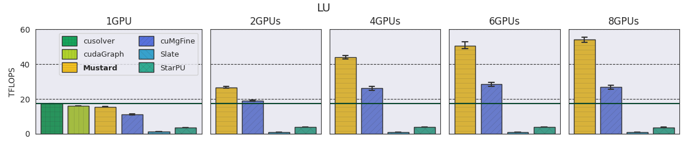
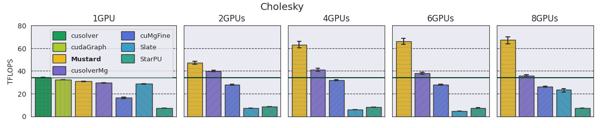

# Mustard: MUlti-gpu Scheduling of TAsk gRaphs on the Device

Mustard is a device-side execution model for static task graphs that moves the
runtime functionality to the GPU, minimizing runtime overheads. It transforms a
single-GPU CUDA graph so that it can be executed across multiple GPUs — without
code changes or learning the APIs of a runtime system. Dependencies and load are
tracked on the device, removing the need for in-kernel synchronisation while
introducing little additional overhead. Memory management, data transfers, and
task allocation all happen on the device.

**Paper:** [Mustard – ACM ICS '25](https://dl.acm.org/doi/10.1145/3721145.3730426)

### Key Results

* In a **multi-node** scenario with 64 GPUs, Mustard achieves an average
  **5.83× speedup** over the linear algebra library SLATE.
* On a **single node**, compared to the best-performing baseline, Mustard
  delivers an average **1.66× speedup for LU** and **1.29× for Cholesky**.

#### Single-node performance (8 GPUs, N = 24 000)




#### Multi-node performance (8 × 8 GPUs)


---

## Dependencies

| Dependency | Minimum Version | Notes |
|---|---|---|
| C++ compiler | C++17 support | GCC ≥ 11 recommended |
| CUDA Toolkit | 12.3 | |
| [NVSHMEM](https://docs.nvidia.com/nvshmem/install-guide/index.html) | 2.7.0 | InfiniBand GPUDirect Async support* |
| OpenMPI | 4.1.4 | Or any MPI implementation supported by NVSHMEM |
| CMake | 3.23 | |

\* GPUDirect Async is required for multi-node execution.

### Optional (baselines)

| Dependency | Purpose |
|---|---|
| [StarPU](https://starpu.gitlabpages.inria.fr/) ≥ 1.3 | StarPU LU / Cholesky baselines |
| [SLATE](https://icl.utk.edu/slate/) | SLATE LU / Cholesky baselines |
| Intel MKL | Required if your SLATE installation was built against MKL |

### Plotting scripts

| Package | Install |
|---|---|
| Python ≥ 3.8 | — |
| seaborn | `pip install seaborn` |
| pandas | `pip install pandas` |
| matplotlib | `pip install matplotlib` |

Or install all at once:

```bash
pip install seaborn pandas matplotlib
```

---

## Building

### 1. Environment

Make sure the CUDA toolkit, NVSHMEM, and MPI are visible. A typical setup:

```bash
export CUDA_HOME=/usr/local/cuda-12.3
export NVSHMEM_HOME=/path/to/nvshmem-2.10
export PATH="$CUDA_HOME/bin:$NVSHMEM_HOME/bin:$PATH"
export LD_LIBRARY_PATH="$NVSHMEM_HOME/lib:$LD_LIBRARY_PATH"
export NVSHMEM_BOOTSTRAP=MPI          # required for multi-PE runs
```

For baselines, also set:

```bash
# StarPU (for StarPU baselines)
export STARPU_DIR=/path/to/starpu              # StarPU install prefix
export PKG_CONFIG_PATH="$STARPU_DIR/lib/pkgconfig:$PKG_CONFIG_PATH"

# SLATE (for SLATE baselines)
export SLATE_DIR=/path/to/slate                # SLATE install prefix
export LD_LIBRARY_PATH="$SLATE_DIR/lib:$LD_LIBRARY_PATH"

# MKL (only if SLATE was built against MKL)
export MKLROOT=/opt/intel/oneapi/2024.1        # or wherever MKL is installed
export LD_LIBRARY_PATH="$MKLROOT/lib:$LD_LIBRARY_PATH"
```

### 2. Configure & compile

```bash
mkdir -p build && cd build

cmake .. \
    -DCMAKE_CUDA_COMPILER=$CUDA_HOME/bin/nvcc \
    -DNVSHMEM_DIR=$NVSHMEM_HOME/lib/cmake/nvshmem \
    -DMUSTARD_CUDA_ARCHITECTURES=80        # adjust to your GPU (e.g. 80 for A100, 90 for H100)

make -j$(nproc)
```

This produces three executables in the `build/` directory:

| Binary | Description |
|---|---|
| `lu_mustard` | LU decomposition (single-node, 1–N GPUs) |
| `cholesky_mustard` | Cholesky decomposition (single-node, 1–N GPUs) |
| `p_lu_mustard` | Partitioned LU (multi-node) |

#### CMake options

| Option | Default | Description |
|---|---|---|
| `MUSTARD_CUDA_ARCHITECTURES` | `native` | CUDA SM architectures (e.g. `80`, `80;90`) |
| `MUSTARD_CUDA_MIN_VERSION` | `12.3` | Minimum required CUDA version |
| `MUSTARD_BUILD_BASELINES` | `OFF` | Build baselines (cuSOLVER-Mg, StarPU, SLATE) |

### 3. Building baselines (optional)

Pass `-DMUSTARD_BUILD_BASELINES=ON` and point CMake to the baseline
dependencies.  Each baseline is **skipped gracefully** if its dependency is
not found, so you can build whichever subset you have installed.

```bash
cmake .. \
    -DCMAKE_CUDA_COMPILER=$CUDA_HOME/bin/nvcc \
    -DNVSHMEM_DIR=$NVSHMEM_HOME/lib/cmake/nvshmem \
    -DMUSTARD_CUDA_ARCHITECTURES=80 \
    -DMUSTARD_BUILD_BASELINES=ON \
    -DCMAKE_PREFIX_PATH="$SLATE_DIR"       # for SLATE + blaspp + lapackpp

make -j$(nproc)
```

StarPU is discovered via `pkg-config` (set `PKG_CONFIG_PATH` as shown above).
SLATE is discovered via CMake's `find_package`; if SLATE was built against MKL,
set `MKLROOT` so the linker can find the MKL shared libraries.

| Baseline target | Dependency | Discovery |
|---|---|---|
| `cusolver_MgGetrf_example` | CUDA Toolkit | Automatic |
| `cusolver_MgPotrf_example` | CUDA Toolkit | Automatic |
| `starpu_lu_example` | StarPU ≥ 1.3 | `pkg-config` (`PKG_CONFIG_PATH`) |
| `starpu_cholesky_tile_tag` | StarPU ≥ 1.3 | `pkg-config` (`PKG_CONFIG_PATH`) |
| `lu_slate` | SLATE | `CMAKE_PREFIX_PATH` / `slate_DIR` |
| `chol_slate` | SLATE | `CMAKE_PREFIX_PATH` / `slate_DIR` |

---

## Running

All Mustard executables are launched through NVSHMEM (via MPI). The number of
GPUs is determined by the number of MPI ranks.

### Single GPU

```bash
./lu_mustard -n=600 -t=2 --tiled --verify
./cholesky_mustard -n=600 -t=2 --subgraph --verify
```

### Multiple GPUs (single node)

```bash
mpirun -np 4 ./lu_mustard -n=6000 -t=10 --subgraph -r=5
mpirun -np 8 ./cholesky_mustard -n=24000 -t=8 --tiled -r=10
```

### Multiple nodes (partitioned LU)

```bash
mpirun -np 64 ./p_lu_mustard -n=48000 -t=64 -r=5 --verify
```

### CLI reference

Run any executable with `--help` to see all options:

```
$ ./lu_mustard --help
Usage: ./lu_mustard [options]

  LU decomposition on one or more GPUs using CUDA graphs.
  The number of GPUs is determined by the number of NVSHMEM PEs (MPI ranks).

  Mode (pick one; default is single-kernel if none given):
    --tiled              Tiled execution (one graph per tile step)
    --subgraph           Sub-graph insertion execution

  Common options:
    -n, -N=<int>         Matrix dimension N                       [default: 15]
    -t, -T=<int>         Number of tiles (N must be divisible)    [default: 5]
    --sm, --smLimit=<int> SM limit per kernel (1-108)             [default: 20]
    --ws, --workspace=<int> cuBLAS workspace in kB (1-1048576)   [default: 256]
    -r, --runs=<int>     Number of timing runs                    [default: 1]
    -v, --verbose        Enable verbose output
    --verify             Verify result correctness
    --dot                Dump execution graph in DOT format

  Examples:
    ./lu_mustard -n=600 -t=2 --tiled --verify
    mpirun -np 4 ./lu_mustard -n=6000 -t=10 --subgraph -r=5
```

`p_lu_mustard` additionally accepts `-p, -P=<int>` to select which PE's graph
to print (default 0, use -1 to disable).

---

## Project Structure

```
mustard/
├── CMakeLists.txt              # Top-level build
├── include/                    # Shared headers
│   ├── cli.h                   # CLI parsing & help messages
│   ├── gen.h                   # Matrix generation (CPU & GPU)
│   ├── verify.h                # LU / Cholesky verification
│   ├── nvshmem_kernels.h       # NVSHMEM put/get device kernels
│   ├── gpu_debug.h             # Device-side debug utilities
│   └── utils.h                 # CUDA error checking, timing
├── mustard/                    # Core library & executables
│   ├── mustard.h               # TiledGraphCreator, CUDA graph helpers
│   ├── lu_mustard.cu           # Single-node LU
│   ├── cholesky_mustard.cu     # Single-node Cholesky
│   └── lu_mustard_p.cu         # Partitioned multi-node LU
├── baselines/                  # Baseline implementations
│   ├── cusolver_Mg/            # cuSOLVER multi-GPU (LU & Cholesky)
│   ├── starpu/                 # StarPU task-based runtime
│   │   ├── lu/                 # StarPU LU kernel
│   │   └── cholesky/           # StarPU Cholesky kernel
│   └── slate/                  # SLATE distributed dense LA
└── scripts/                    # Plotting & benchmarking scripts
    ├── calc.py                 # Bar-chart FLOPS analysis
    ├── plot.py                 # Line-plot generator
    ├── lu_all.sh               # LU benchmark runner
    ├── chol_all.sh             # Cholesky benchmark runner
    ├── figures/                # Pre-generated result figures
    └── results/                # Raw result data
```

### Plotting scripts

Generate performance bar charts:

```bash
# Run from scripts/results/
cd scripts/results
python ../calc.py -m lu -s 24000
python ../calc.py -m chol -s 24000
```

Generate line plots:

```bash
# Run from scripts/
cd scripts
python plot.py -m lu -s 24000 -f png -l      # PNG with legend
python plot.py -m chol -s 48000 -f pdf        # PDF
```

Options for both scripts: `-m {lu,chol}`, `-s <size>`, `-l` (legend), `-t` (title).
`plot.py` also accepts `-f {pdf,png,jpg}` and `-show` (display interactively).

---

## Acknowledgement

This project has received funding from the European Research Council (ERC)
under the European Union's Horizon 2020 research and innovation programme
(grant agreement No 949587).
